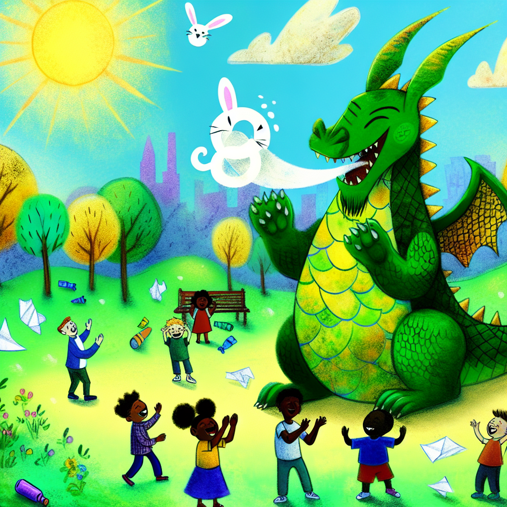
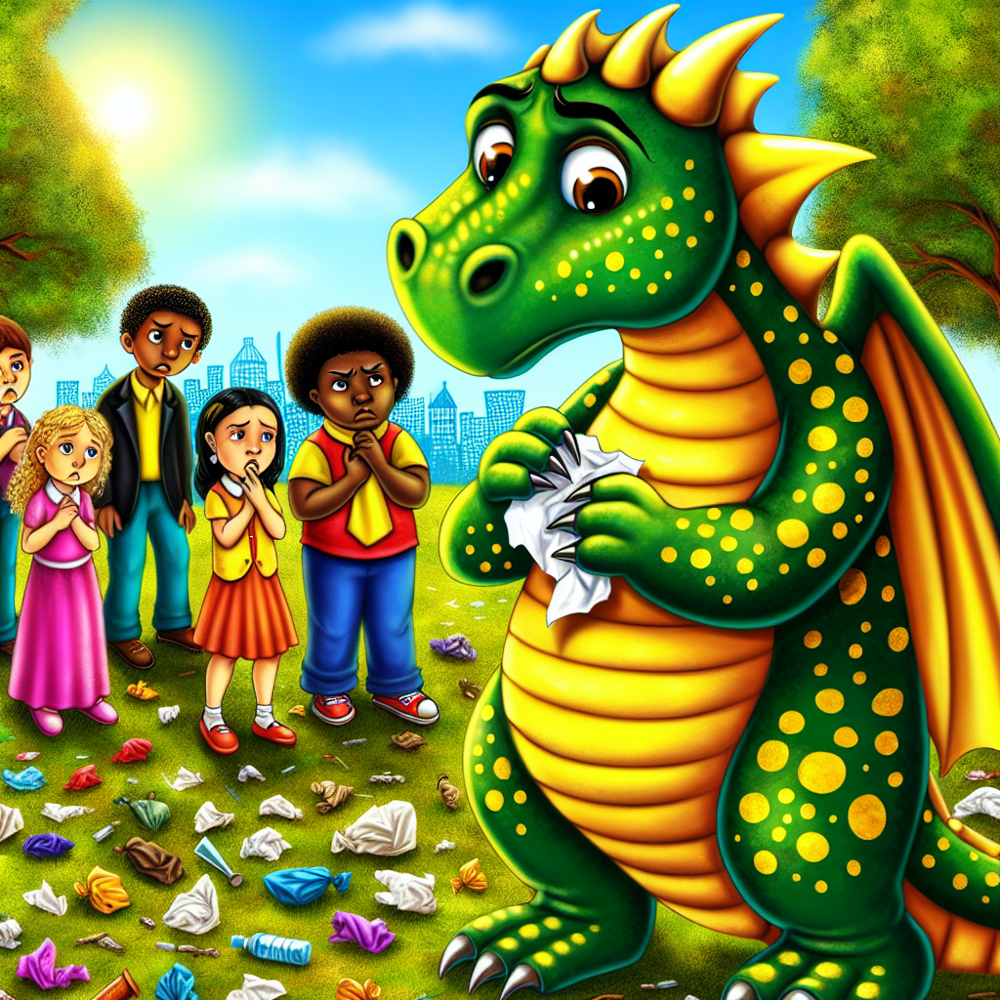
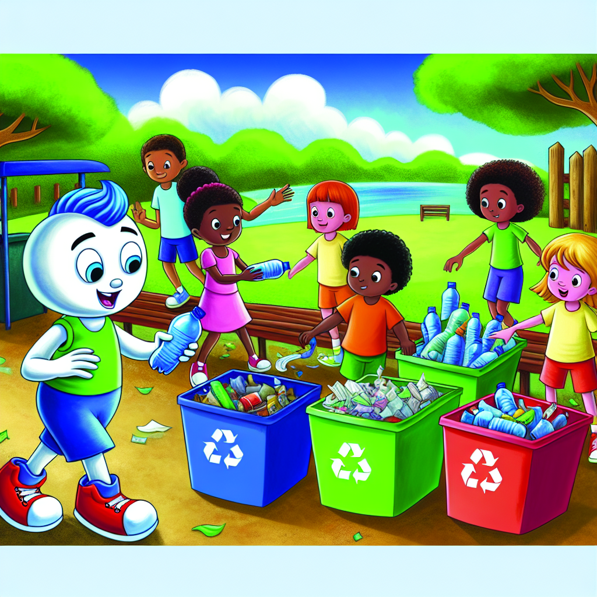
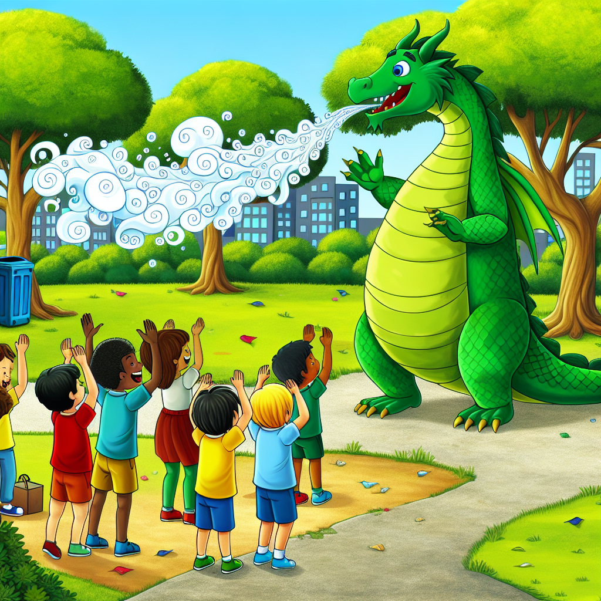

# Dizzy the Dragon Learns to Recycle

Once upon a time, in the colorful town of Green Meadows, there lived a friendly dragon named Dizzy. Dizzy was not like other dragons. Instead of breathing fire, Dizzy could puff out playful clouds of smoke in the shapes of animals. He had shimmering green scales that sparkled in the sunlight and big, gentle eyes that made everyone feel at ease.

Dizzy loved playing with the children of Green Meadows. One sunny afternoon, while playing in the park, Dizzy noticed many plastic bottles and paper scattered all around. The sight made his heart sink.

"Why is there so much trash here?" Dizzy asked, picking up a crumpled paper with his gentle claws.

Lisa, one of the children, looked embarrassed. "Sometimes we forget to clean up after playing," she admitted.

Dizzy tilted his head, thinking deeply. "What if I told you we could turn this trash into something wonderful?"

The children, curious and excited, gathered around Dizzy. "How can we do that?" asked a small boy named Timmy.

"It's simple," Dizzy grinned. "We can recycle! Recycling helps us transform old things into new ones and keeps our town clean and beautiful."

Dizzy and the children set to work. They gathered all the trash in the park and sorted it into different types: plastics, papers, and metals. Dizzy explained how each material could be recycled and reused.

"Plastic bottles can be turned into toys or even clothes," Dizzy explained as he helped Timmy put the bottles in a blue recycling bin.

"And paper can become new notebooks or even art paper for us to draw on," Lisa added, placing stacks of paper in a green bin.

As they worked, Dizzy shared a magical secret. "For every bin we fill, I will show you a special smoke shape!" This made the recycling even more fun. Each time they filled a bin, Dizzy puffed out a delightful smoke figure—a dancing elephant, a soaring eagle, or a playful dolphin. The children clapped and cheered with each creation.

After they finished, the park looked beautiful and clean. The children stood back and admired their work, feeling proud and happy.

"Recycling is like magic," Timmy said in awe.

"Yes, it is," Dizzy agreed with a nod. "And you all helped make our park magical again."

From that day on, Dizzy became not just a playmate but also a recycling buddy. Every week, he would visit the park to help the children recycle. Together, they kept Green Meadows clean and learned about the importance of taking care of the environment.

Dizzy taught them that recycling was not just about turning old things into new ones, but it was also about caring for their town and the Earth. The children of Green Meadows learned to be responsible and thoughtful, and they spread the word about recycling to their families and friends.

The story of Dizzy the Dragon and the recycling children of Green Meadows spread far and wide, inspiring other towns to take action too. And so, with the help of a friendly dragon, the world became a little greener, one recycled item at a time.

And whenever anyone asked the children of Green Meadows why their town was so clean and beautiful, they would smile and say, "Dizzy the Dragon taught us the magic of recycling!"